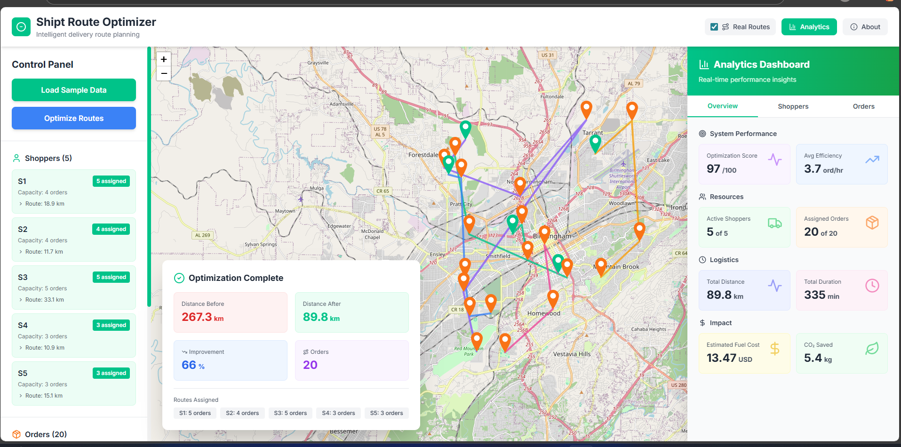

# 🚀 Multi-Strategy Routing Engine

A full-stack web application for optimizing grocery delivery routes using intelligent assignment algorithms. Built with Go and React, this demo showcases Shipt's approach to logistics optimization.




## ✨ Features

### Core Optimization
- **Smart Route Optimization**: Nearest-neighbor clustering algorithm
- **Real Driving Routes**: Actual road-based routing (toggle between real routes vs. straight-line)
- **Capacity Management**: Intelligent assignment respecting shopper capacity limits

### Analytics Dashboard
- **System Performance**: Optimization score, efficiency metrics, resource utilization
- **Shopper Analytics**: Individual performance, capacity utilization, time estimates
- **Order Insights**: Distribution analysis, density mapping, time window breakdown
- **Cost & Impact**: Fuel cost estimates, CO₂ savings calculations

### Visualization
- **Interactive Maps**: Powered by Leaflet.js with real route geometry
- **Live Updates**: Real-time route visualization as optimization runs
- **Performance Metrics**: Comprehensive statistics and KPIs
- **Modern UI**: Sleek interface with Shipt branding and smooth animations

## 🏗️ Architecture

```
shipt-route-optimizer/
├── backend/                 # Go REST API
│   ├── cmd/
│   │   └── main.go         # Application entry point
│   ├── internal/
│   │   ├── api/            # HTTP handlers
│   │   ├── models/         # Data structures
│   │   ├── optimizer/      # Route optimization logic
│   │   └── data/           # Mock data generation
│   ├── go.mod
│   └── Makefile
│
└── frontend/               # React SPA
    ├── src/
    │   ├── components/     # React components
    │   ├── api/            # API client
    │   ├── App.jsx
    │   └── main.jsx
    ├── package.json
    └── vite.config.js
```

## 🛠️ Tech Stack

### Backend
- **Go 1.21+** - High-performance backend
- **Gin** - HTTP web framework
- **CORS** - Cross-origin resource sharing
- **OpenRouteService** - Real driving route calculation (optional)

### Frontend
- **React 18** - UI library
- **Vite** - Build tool & dev server
- **TailwindCSS** - Utility-first CSS
- **Leaflet.js** - Interactive maps
- **Framer Motion** - Smooth animations
- **Lucide React** - Icon library

## 🚦 Getting Started

### Prerequisites

- **Go 1.21+** ([Download](https://go.dev/dl/))
- **Node.js 18+** ([Download](https://nodejs.org/))
- **npm or yarn**

### Installation & Setup

#### 1️⃣ Clone the Repository

```bash
cd "Route Optimizer"
```

#### 2️⃣ Configure Environment Variables

Copy the example environment file and add your API keys:

```bash
cd backend
cp .env.example .env
```

Edit `.env` and add your OpenRouteService API key (optional but recommended for real routing):
- Get a free API key at: https://openrouteservice.org/dev/#/signup
- Update the `OPENROUTE_API_KEY` value in `.env`

#### 3️⃣ Start the Backend (Port 8080)

Open a terminal and run:

**Option A: Using PowerShell (Recommended for Windows - loads .env automatically)**
```powershell
cd backend
.\run.ps1
```

**Option B: Using Go directly**
```bash
cd backend
go mod download
go run cmd/main.go
```

**Option C: Using Make**
```bash
cd backend
make run
```

You should see:
```
✓ Loaded .env file successfully
✓ OpenRouteService API Key loaded (120 chars)
🚀 Multi-Strategy Routing Engine Backend starting on :8080
```

**Note:** If you see "⚠ WARNING: OPENROUTE_API_KEY not found", the .env file wasn't loaded. Real routing will fallback to straight lines.

#### 4️⃣ Start the Frontend (Port 5173)

Open a **new terminal** and run:

```bash
cd frontend
npm install
npm run dev
```

The app will open automatically at **http://localhost:5173**

## 📖 Usage Guide

1. **Load Sample Data**
   - Click the "Load Sample Data" button
   - 5 shoppers and 20 orders will appear on the map around Birmingham, AL

2. **Choose Algorithm**
   - **Greedy**: Fast nearest-neighbor (default)
   - **A* Search**: Optimal pathfinding with heuristics ⭐
   - Toggle between them to compare performance!

3. **Toggle Real Routes** (Optional)
   - Enable the "Real Routes" checkbox in the header
   - Routes will use actual driving directions instead of straight lines
   - Note: Uses OpenRouteService API (may take a few seconds)

4. **Optimize Routes**
   - Click "Optimize Routes"
   - Watch routes animate on the map
   - Analytics dashboard automatically opens on the right

5. **Compare Algorithms**
   - Run optimization with "Greedy" → Note the total distance
   - Switch to "A* Search" and optimize again → Compare results!
   - Typically 10-20% improvement with A*

6. **Explore Analytics**
   - **Overview Tab**: System-wide metrics, optimization score, costs
   - **Shoppers Tab**: Individual shopper performance and efficiency
   - **Orders Tab**: Order distribution and density analysis
   - Click "Analytics" button to toggle dashboard visibility

7. **Explore the Map**
   - Green markers = Shoppers
   - Orange markers = Orders
   - Solid/dashed lines = Optimized routes (solid = real routes, dashed = straight lines)
   - Click markers for detailed information

6. **View Metrics**
   - Total distance & duration
   - Optimization score (0-100)
   - Capacity utilization per shopper
   - Time estimates for each route
   - Fuel costs & CO₂ impact

## 🧮 Algorithm Details

### Optimization Algorithms

The application offers **two optimization algorithms**:

#### 1. Greedy Nearest-Neighbor (Fast)
- **Distance Calculation**: Haversine formula for accurate geospatial distances
- **Assignment**: Each order assigned to the nearest available shopper
- **Capacity Management**: Respects individual shopper capacity limits
- **Route Ordering**: Orders sorted by proximity for efficient routing
- **Performance**: Very fast (~10ms), good solutions
- **Use Case**: Real-time optimization, large datasets

#### 2. A* Search (Optimal) ⭐ NEW!
- **Intelligent Search**: Combines actual costs with heuristic estimates
- **MST Lower Bound**: Sophisticated heuristic for better path exploration
- **Guaranteed Optimal**: Finds shortest routes for small order sets (≤8 orders)
- **Beam Search**: Near-optimal solutions for larger sets (>8 orders)
- **Performance**: Slower (~100-200ms), 10-20% better routes
- **Use Case**: When optimality matters, fuel cost minimization

**See `ASTAR_ALGORITHM.md` for detailed technical explanation.**

### Distance Formula

```go
func HaversineDistance(lat1, lng1, lat2, lng2 float64) float64 {
    const earthRadius = 6371.0 // kilometers
    // ... haversine implementation
}
```

## 🌐 API Endpoints

### `GET /api/health`
Health check endpoint

**Response:**
```json
{
  "status": "ok",
  "service": "shipt-route-optimizer"
}
```

### `GET /api/sample-data`
Returns mock orders and shoppers

**Response:**
```json
{
  "orders": [...],
  "shoppers": [...]
}
```

### `POST /api/optimize`
Basic route optimization (legacy)

**Request:**
```json
{
  "orders": [...],
  "shoppers": [...]
}
```

**Response:**
```json
{
  "assignments": [...],
  "totalDistanceBefore": 20.8,
  "totalDistanceAfter": 11.2
}
```

### `POST /api/optimize-analytics` ⭐ New!
Advanced optimization with comprehensive analytics

**Request:**
```json
{
  "orders": [...],
  "shoppers": [...],
  "useRealRoutes": true
}
```

**Response:**
```json
{
  "optimization": {
    "assignments": [...],
    "totalDistanceBefore": 20.8,
    "totalDistanceAfter": 11.2
  },
  "analytics": {
    "system": {
      "optimizationScore": 87.5,
      "totalDistance": 45.3,
      "totalDuration": 125.5,
      "estimatedFuelCost": 6.80,
      "co2Saved": 2.72,
      ...
    },
    "shoppers": [
      {
        "shopperId": "S1",
        "ordersAssigned": 4,
        "totalDistance": 11.2,
        "totalDuration": 48.5,
        "capacityUtilization": 80.0,
        "efficiency": 4.94,
        ...
      }
    ],
    "orders": {...},
    "routeGeometries": [...]
  }
}
```

## 🎨 Design Philosophy

- **Shipt Brand Colors**: Primary green (#00C389) throughout
- **Clean & Modern**: Minimal design with smooth transitions
- **Responsive**: Works on desktop and tablet screens
- **Accessible**: Clear labels and semantic HTML

## 🔧 Development Commands

### Backend

```bash
# Run server
make run

# Build binary
make build

# Run tests
make test

# Clean build artifacts
make clean
```

### Frontend

```bash
# Development server
npm run dev

# Production build
npm run build

# Preview production build
npm run preview
```

## 📦 Building for Production

### Backend

```bash
cd backend
make build
./bin/shipt-route-optimizer
```

### Frontend

```bash
cd frontend
npm run build
# Deploy the 'dist' folder to your hosting service
```

## 🐛 Troubleshooting

### Backend won't start

- Ensure port 8080 is available
- Check Go version: `go version` (needs 1.21+)
- Run `go mod download` to fetch dependencies

### Frontend can't connect to backend

- Verify backend is running on port 8080
- Check CORS configuration in `backend/cmd/main.go`
- Ensure `frontend/src/api/optimizer.js` points to correct URL

### Map not displaying

- Check browser console for errors
- Ensure Leaflet CSS is loaded
- Verify internet connection (map tiles load externally)

## 🤝 Contributing

This is a demo project. For production use:

- Add authentication & authorization
- Implement persistent data storage
- Add comprehensive test coverage
- Optimize for large-scale datasets
- Add real-time updates via WebSockets

## 📄 License

This project is for demonstration purposes.

## 👏 Acknowledgments

Built for Shipt as a showcase of modern full-stack development practices.

---

**Built with ❤️ using Go and React**

